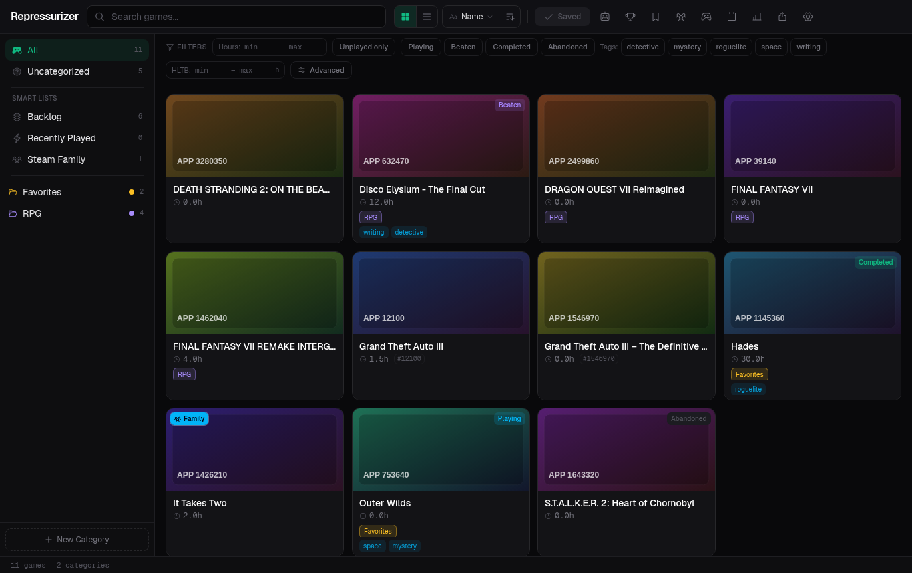

# Repressurizer

[](https://github.com/Crimsab/Repressurizer/actions/workflows/ci.yml)
[](https://github.com/Crimsab/Repressurizer/actions/workflows/release.yml)
[](https://github.com/Crimsab/Repressurizer/releases/latest)
[](https://github.com/Crimsab/Repressurizer/releases)
[](LICENSE)
[](https://tauri.app/)
[](docs/localization.md#localization-status)

Repressurizer is a modern desktop Steam library manager for editing Steam collections, organizing backlogs, and deciding what to play next.

It is a spiritual successor to Depressurizer: same useful idea, rebuilt as a separate Tauri app with a Rust backend and a React interface.



## Status

Early Windows release. Repressurizer can read and write local Steam collection data, but it is still young software: keep backups enabled, use the preview before saving, and close Steam before applying collection changes.

## Download

Always download the newest build from the [latest release page](https://github.com/Crimsab/Repressurizer/releases/latest).

- Recommended: `Repressurizer_..._x64-setup.exe` for the normal Windows installer.
- Portable: `Repressurizer-portable-windows-x64.zip` if you prefer to run it without installing.
- CLI: `Repressurizer-cli-windows-x64.zip` for scriptable diagnostics, snapshot export, and read-only Steam tooling.
- Auto-update metadata: `latest.json` is used by the built-in updater.

Older releases remain available on the [releases page](https://github.com/Crimsab/Repressurizer/releases).

## Quick Start

1. Install Repressurizer or unzip the portable build.
2. Open Settings and add a Steam Web API key from <https://steamcommunity.com/dev/apikey>.
3. Load your Steam library, keep backups enabled, and use the save preview before writing collection changes.

## Features

### Steam Collection Editing

- Detects local Steam installs and Steam users.
- Reads and writes Steam's modern collection catalog from `cloud-storage-namespace-1.json` and the Steam UI LevelDB cache when available.
- Creates automatic backups before saving, including the matching Steam LevelDB catalog value when present, and supports manual backups/restores.
- Shows a save preview before writing collection changes.
- Lets you drag games into collections, bulk-select games, and edit multiple games at once.
- Keeps hidden games separate from normal library browsing.
- Can merge games that exist only in local Steam collections back into the visible library view.

### Library Browsing

- Grid and list views with Steam header/capsule artwork.
- Search by plain text or regex.
- Sort by name, playtime, last played, App ID, Metacritic, HLTB length, achievements, or local status.
- Right-click games to open details, launch with Steam, open the Steam store page, hide/unhide, set status, and manage collection membership.
- Game detail pages show metadata, categories, platforms, tags, personal notes, personal rating, achievements, HLTB time, and price data when available.

### Filters

- Playtime range and unplayed-only filters.
- HLTB main-story duration range.
- Personal status filters: Playing, Beaten, Completed, Abandoned.
- Local tag filters.
- Release year range.
- Platform filters: Windows, Mac, Linux.
- Metacritic score range.
- Achievement completion percentage range.
- Steam Family shared games.
- Possible duplicate games.
- Local collection-only games.
- Missing metadata.
- Likely delisted/unavailable Steam store entries.

### Search Query Syntax

The search box supports both normal text and structured filters:

```text
stalker
/final.*vii/i
hours:>10
playtime:2..40
hltb:<20
year:2013..2020
released:>=2024-01-01
genre:rpg
category:achievement
tag:backlog
dev:"Square Enix"
pub:capcom
platform:windows
status:playing
rating:>=8
metacritic:>85
achievements:50..100
family:true
duplicate:true
missing:true
delisted:true
appid:39140
```

Plain text search normalizes punctuation and dotted acronyms, so `stalker` matches `S.T.A.L.K.E.R.` titles.

### Auto-Categorizing

Repressurizer can generate Steam collections from your library data:

- By playtime buckets, such as short, medium, long, endless.
- By Steam genres.
- By Steam tags/categories.
- By release year, half-decade, or decade.
- By Metacritic score.
- By HLTB main-story duration.

Auto-categorizing uses cached metadata when possible, fetches missing Steam details in the background, and can create a backup before applying generated collections.

### Integrations And Data Sources

- Steam Web API: owned games, playtime, achievements, player summaries, friends comparison, wishlist, and store metadata.
- Steam Store API: game details, genres, categories, release dates, platforms, Metacritic, price data, and artwork.
- Steam Family: detects Family-shared apps with the Web API key when possible, with an optional Store `webapi_token` fallback for accounts where Steam requires Store-session auth.
- HowLongToBeat: fetches main story, main plus extras, completionist time, and confidence data.
- Automation export: writes or publishes a stable `repressurizer.library-snapshot.v1` JSON snapshot with games, collections, Steam metadata, HLTB data, and optional achievement/wishlist/Steam Family summaries. HTTP targets are configurable and uploads are skipped when the snapshot checksum has not changed.
- Integration libraries: TypeScript receivers can use `@crimsab/repressurizer-integration`; Rust receivers can use `repressurizer-integration`.
- CLI: the release includes `repressurizer-cli` for JSON diagnostics, snapshot export/publish, cache inspection, backups, SAM probe/schema/backup commands, and guarded SAM achievement actions.
- Local Steam files: reads and writes collection data directly, with backups.

For setup, receiver expectations, CLI usage, and schema/package details, see [docs/automation-export.md](docs/automation-export.md), [docs/cli.md](docs/cli.md), and [docs/integrations/repressurizer-snapshot-v1.md](docs/integrations/repressurizer-snapshot-v1.md).

### Planning And Discovery Tools

- What to Play Next recommendations based on status, rating, genre, HLTB length, and metadata.
- Library statistics for playtime, genres, platforms, publishers, Metacritic, value, and completion.
- Play history timeline.
- Wishlist view.
- Achievements overview.
- Friends comparison.
- Diagnostics export with redaction for safer bug reports.


## Requirements

- Windows 10/11.
- Steam installed locally.
- WebView2 Runtime. It is already installed on most current Windows systems.
- A Steam Web API key for library details: <https://steamcommunity.com/dev/apikey>

Linux and macOS support are possible, but Windows is the supported target for the first release.

## Known Limitations

- Windows is the only supported platform for now.
- Steam Family data depends on Steam endpoints that may require a Store `webapi_token` for some accounts.
- HLTB and Steam Store metadata are fetched from unofficial/public endpoints and can occasionally rate-limit, move, or return incomplete data.
- Some delisted or region-restricted games may have partial metadata even when they still exist in your library.
- The app is unsigned, so Windows SmartScreen may warn on early releases.

## Safety

Repressurizer is designed around local files. It needs file access so it can detect Steam installs, read collection data, write collection changes, and create/restore backups. On current Steam clients it may update both `cloud-storage-namespace-1.json` and Steam's local LevelDB catalog cache. The first-run setup explains this before any save operation.

Before public testing:

- Close Steam before saving collection changes.
- Keep automatic backups enabled.
- Use the save preview to inspect what will change.
- Keep a manual backup if you are testing against a library you care about.

Diagnostics exports are redacted and should not include Steam Web API keys, Store tokens, or full Steam IDs.

For local data and network behavior, see [docs/privacy.md](docs/privacy.md).

## Development

Use Bun for JavaScript dependencies and scripts.

```bash
bun install
bun run check
bun run test:unit
bun run test:e2e
bun run build
```

`bun run test` runs both unit tests and the Playwright browser smoke checks. Playwright attaches dashboard/settings screenshots under `test-results/` for visual review.

Localization coverage is tracked in [docs/localization.md](docs/localization.md#localization-status). Use `bun run i18n:status` to print the table locally and `bun run i18n:status:write` to refresh the generated doc block.

For a local Windows build:

```powershell
bun install
bun tauri build
```

For cross-compiling a Windows portable build from Linux:

```bash
bash build.sh
```

Release builds are produced by GitHub Actions as:

- NSIS installer
- portable Windows zip
- CLI Windows zip

Version tags are created from `package.json` (`v0.1.0`, `v0.2.0`, ...). Each tag triggers a GitHub Release with generated changelog notes and Windows artifacts.
After CI passes, matching integration package tags are also created from `packages/integration/package.json` and `packages/rust/Cargo.toml` when those versions have not been released yet.

For Steam Family setup and the optional Store `webapi_token` fallback, see [docs/steam-family.md](docs/steam-family.md).

For automation export and integration libraries, see [docs/automation-export.md](docs/automation-export.md).

For contribution guidelines, see [CONTRIBUTING.md](CONTRIBUTING.md). For private vulnerability reporting guidance, see [SECURITY.md](SECURITY.md).

## Data And Backups

Repressurizer stores its own cache/settings under the operating system data directory in a `Repressurizer` folder. Steam collection backups are stored next to the Steam collection file they protect.

Steam collection edits affect local Steam data. Make a backup before testing against a real library.

## Attribution

Repressurizer is inspired by Depressurizer, which is licensed under GPLv3. Repressurizer is a separate project and is not affiliated with Valve, Steam, or the Depressurizer maintainers.

## License

Repressurizer is licensed under the GNU General Public License v3.0. See [LICENSE](LICENSE).
