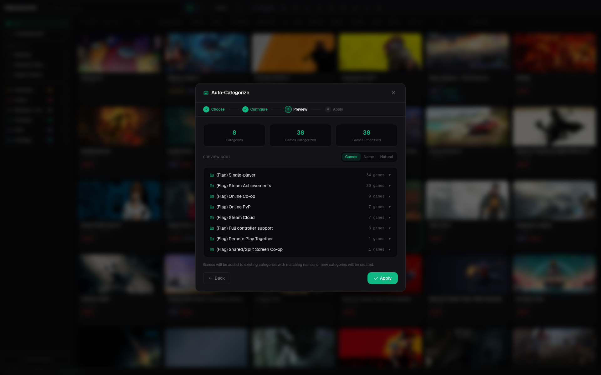
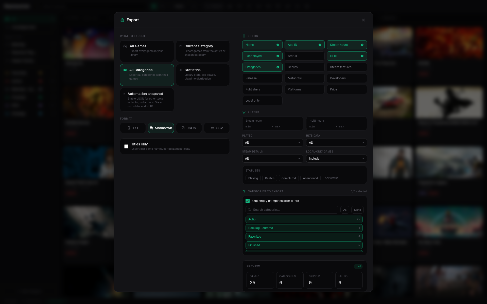
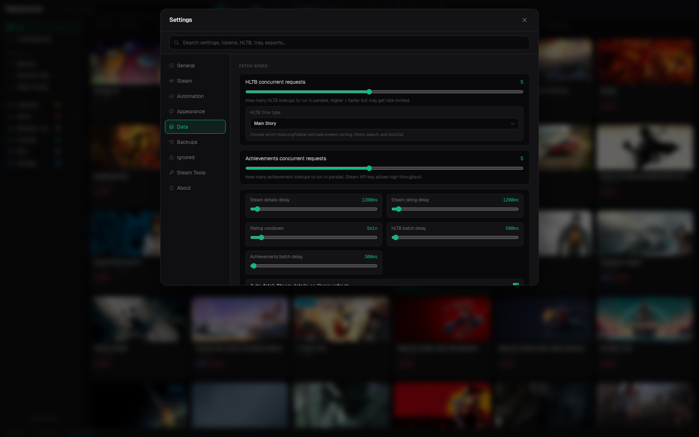

# Repressurizer

[](https://github.com/Crimsab/Repressurizer/actions/workflows/ci.yml)
[](https://github.com/Crimsab/Repressurizer/releases/latest)
[](https://github.com/Crimsab/Repressurizer/releases)
[](LICENSE)
[](https://tauri.app/)

Repressurizer is a modern Windows app for organizing large Steam libraries.
It edits local Steam collections, enriches your games with cached metadata,
builds AutoCat collections, exports clean library snapshots, and keeps backups
before it writes anything back to Steam's local files.

It is inspired by Depressurizer, but rebuilt as a separate Tauri application
with a Rust backend and a React interface.

## Preview


[Open the higher-quality WebM demo](docs/assets/repressurizer-demo.webm).

## Highlights

- Edit Steam collections from a fast desktop UI.
- Sort, search, filter, tag, rate, and track personal game status.
- Fetch and cache Steam details, reviews, prices, achievements, wishlist data,
  Steam Family entries, and HowLongToBeat times.
- Generate collections with AutoCat from genres, tags, store flags, release
  year, review rating, Metacritic, HLTB length, playtime, languages, platforms,
  developers, publishers, and saved presets.
- Export filtered game lists, category sets, statistics, or stable JSON
  snapshots for other tools.
- Publish automation snapshots to HTTP receivers, with checksum-based skips.
- Use optional Steam Tools for integration with other tools.

## Download

Download the newest build from the
[latest release page](https://github.com/Crimsab/Repressurizer/releases/latest).

| Asset | Use |
| --- | --- |
| `Repressurizer_..._x64-setup.exe` | Normal Windows install. |
| `Repressurizer-portable-windows-x64.zip` | Portable app without installation. |
| `Repressurizer-cli-windows-x64.zip` | Scriptable diagnostics, snapshots, cache checks, and guarded Steam tooling. |
| `latest.json` | Built-in updater metadata. |

Older builds are available on the
[releases page](https://github.com/Crimsab/Repressurizer/releases).

## First Run

1. Install Repressurizer or unzip the portable build.
2. Add a Steam Web API key from <https://steamcommunity.com/dev/apikey>.
3. Load your Steam library.
4. Prepare the metadata cache if you want sorting, filters, AutoCat, prices,
   reviews, HLTB, and achievement data ready before browsing.
5. Close Steam before saving collection changes.
6. Review the save preview and keep backups enabled.

Repressurizer does not edit your Steam account remotely. Collection saves are
local file writes; metadata fetches and automation exports are separate network
operations.

## Workflows

### Organize Collections

Repressurizer reads Steam's modern collection catalog and, when available, the
Steam UI LevelDB cache. You can create, rename, duplicate, merge, delete, and
color collections; drag or bulk-move games; hide local-only collection entries;
and save with a preview of every collection that will change.

Automatic backups are created before writes, including the matching Steam
LevelDB catalog value when present.

### Browse And Filter

The library supports grid and list views, Steam artwork, plain text search,
regex search, fuzzy settings search, structured filters, and advanced library
filters. Useful filters include playtime, HLTB length, status, local tags,
release year, platform, Metacritic, achievements, Steam Family, duplicates,
missing metadata, local-only games, and delisted or unavailable store entries.

Examples:

```text
stalker
/final.*vii/i
hours:>10
playtime:2..40
hltb:<20
year:2013..2020
genre:rpg
category:achievement
tag:backlog
dev:"Square Enix"
platform:windows
status:playing
metacritic:>85
achievements:50..100
family:true
duplicate:true
missing:true
appid:39140
```

Plain text search normalizes punctuation, so `stalker` matches
`S.T.A.L.K.E.R.` titles.

### Build AutoCat Collections

AutoCat can create or update collections from local playtime, cached Steam
metadata, HLTB data, Steam reviews, achievements, languages, platforms,
developers, publishers, and saved presets imported from Depressurizer profiles.
It prefers cached data, can fetch missing data in the background, and can run
with cached-only mode when you do not want extra network requests.



### Export And Automate

The export dialog can write filtered TXT, Markdown, JSON, or CSV output with
selectable fields, category inclusion, category skipping, playtime filters,
HLTB filters, status filters, metadata requirements, and local-only handling.

Automation export publishes a stable `repressurizer.library-snapshot.v1` JSON
snapshot to a configured HTTP endpoint. Receivers can use the TypeScript or Rust
integration libraries to validate and consume the payload.



### Plan What To Play

Repressurizer includes library statistics, recommendations, play history,
wishlist view, achievements overview, friends comparison, notes, tags, personal
ratings, and game status tracking.



## Documentation

The README is intentionally short. Detailed behavior lives in `docs/`.

| Topic | Link |
| --- | --- |
| Documentation index | [docs/README.md](docs/README.md) |
| Cache, Steam requests, prices, proxies | [docs/cache-and-network.md](docs/cache-and-network.md) |
| Steam Family setup | [docs/steam-family.md](docs/steam-family.md) |
| Automation export | [docs/automation-export.md](docs/automation-export.md) |
| CLI usage | [docs/cli.md](docs/cli.md) |
| Snapshot schema | [docs/integrations/repressurizer-snapshot-v1.md](docs/integrations/repressurizer-snapshot-v1.md) |
| TypeScript package release notes | [docs/integrations/integration-package-release.md](docs/integrations/integration-package-release.md) |
| Rust crate release notes | [docs/integrations/rust-integration-crate.md](docs/integrations/rust-integration-crate.md) |
| Privacy and local data | [docs/privacy.md](docs/privacy.md) |
| Localization status | [docs/localization.md](docs/localization.md) |

## Requirements

- Windows 10 or Windows 11.
- Steam installed locally.
- WebView2 Runtime, already installed on most current Windows systems.
- A Steam Web API key for library, achievement, wishlist, and Steam metadata.

Linux and macOS support are possible later, but Windows is the supported target
right now. The app is unsigned, so Windows SmartScreen may warn on early
releases.

## Safety Model

Repressurizer is backup-first software. It stores its own cache and settings in
the operating system app data directory and stores Steam collection backups next
to the Steam collection file they protect.

Before saving collection changes:

- Close Steam.
- Keep automatic backups enabled.
- Read the save preview.
- Keep a manual backup when testing against a library you care about.

## Development

```bash
bun install
bun run check
bun run test:unit
bun run test:e2e
bun run build
```

`bun run test` runs unit tests and Playwright browser checks. Playwright stores
test artifacts under `test-results/`.

For a local Windows build:

```powershell
bun install
bun tauri build
```

For cross-compiling a Windows portable build from Linux:

```bash
bash build.sh
```

Release history is generated from tags and Conventional Commit subjects:

```bash
bun run changelog:write
```

This updates `CHANGELOG.md` and the generated changelog used by the in-app Info
page. The release workflow runs the generator before packaging.

## Integration Packages

- TypeScript: [`@crimsab/repressurizer-integration`](https://www.npmjs.com/package/@crimsab/repressurizer-integration)
- Rust: [`repressurizer-integration`](https://crates.io/crates/repressurizer-integration)

## Contributing

See [CONTRIBUTING.md](CONTRIBUTING.md) for contribution guidelines and
[SECURITY.md](SECURITY.md) for private vulnerability reporting.

## Attribution

Repressurizer is inspired by Depressurizer, which is licensed under GPLv3.
Repressurizer is a separate project and is not affiliated with Valve, Steam, or
the Depressurizer maintainers.

## License

Repressurizer is licensed under the GNU General Public License v3.0. See
[LICENSE](LICENSE).
