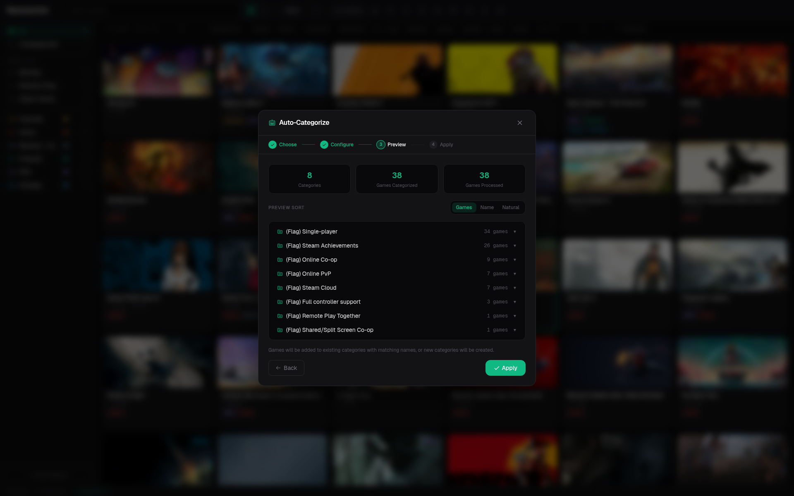

# AutoCat

AutoCat creates or updates Steam collections, or assigns games to a Diary/Kanban
column, from rules rather than manual game selection. The destination is chosen
in the shared AutoCat dialog.

## Available sources

Rules can use every AutoCat source in both destinations: title/name, genres, tags,
store flags, release year, review rating, Metacritic, HLTB length, local playtime,
languages, platforms, developers, publishers, Diary fields, custom conditions, and
saved presets imported from Depressurizer profiles. Achievement summaries are
available in the Diary timeline, but are not currently an AutoCat filter source.

## Safe workflow

1. Prepare the metadata sources used by the rule.
2. Select cached-only mode if you do not want background requests.
3. Generate a preview.
4. Inspect games with missing or uncertain metadata. For a large run, use
   **Export diff** to save a deterministic JSON review file before applying it.
5. Apply only the intended rule scope.
6. Review the normal collection save preview before writing to Steam.

When the destination is **Diary / Kanban**, AutoCat uses a filter-first rule
builder. Choose the data source, configure as many conditions as you need, and
choose how they connect. **All (AND)** and **Any (OR)** set every connector at
once; each connector can then be changed independently for mixed expressions.
AND binds before OR, so `A AND B OR C` is evaluated as `(A AND B) OR C`. The
preview then presents the rule as an explicit **IF / THEN** operation, for
example:

> IF title starts with `N` **and** HLTB main story is under `10h` **and** Steam
> playtime is at least `20h` THEN move the matches to a Diary column.

The **THEN** section is configured in the preview, after the matches are known:
you can move matches to an existing status/custom column, create one column and
optionally move the matches into it, or create one local column per result group
and optionally move each group. Creating a column without moving games is also
supported.

Rows can be duplicated, disabled, removed, or added indefinitely. An incomplete
enabled row (empty title/category/value or invalid regex) blocks the run and is
highlighted inline. If you need more than one independent **IF / THEN** rule,
save each rule as a preset and use **Run all**; the combined preview shows their
union before the shared Diary destination is applied.

After the preview, choose one Kanban action:

- **Move to existing column** changes the matched games to a built-in status or
  assigns them to a local custom column.
- **Create a new column** suggests a readable default name derived from your
  rule source and conditions, which you can rename freely before applying. It
  then creates one local custom column (with the chosen color) and assigns all
  matches to it. An existing column with the same name is reused instead of
  duplicated.
- **Split matches into columns** (opt-in; the default actions never create
  groups) uses any grouping source available in the
  chooser (name, playtime, genre, HLTB, custom rules, and so on). Each created
  or reused local custom column takes the exact meaningful group name — with an
  optional editable prefix — sanitized into a short, collision-safe label, so
  two groups never collapse into one ambiguous column. A maximum-column limit
  and a same-name reuse toggle bound the run. Groups beyond the limit are left
  untouched.

Applying this destination updates only local Diary statuses/assignments. It does
not create or modify Steam collections and does not require a Steam backup.
A Diary preview does not show Steam collection sorting, a filter-result banner,
or group rows by default. It shows the complete **IF / THEN** plan, the matched
count, and an expandable list of matched game titles. Group rows appear only
after you explicitly choose **Split matches into columns**; otherwise every
match goes to the explicit existing/new column selected in **THEN**.
The confirmation step offers **Undo Diary AutoCat**. Undo restores the previous
status, decision, queue order, custom assignment, Timeline event log, and any
columns created by that run. The same undo is also available from the toast.

The exported diff records the rule metadata, preview totals, and App IDs added
to or removed from each collection. It excludes application settings, API keys,
tokens, cookies, and local paths.

## Saved rules

Give a rule a name in the configuration step and press **Save**. Saved AutoCats
survive app restarts and remember whether they target Steam collections or the
Diary, including the selected Kanban action/column. From the chooser, **Run
all** (or **Run cached**) reruns the saved sequence after a Steam metadata
refresh; review the combined preview before applying it.

!!! tip "Prefer explicit rule names"
    Name the collection after the rule's meaning, such as `Backlog - Under 20 hours`, rather than the implementation detail that produced it.
