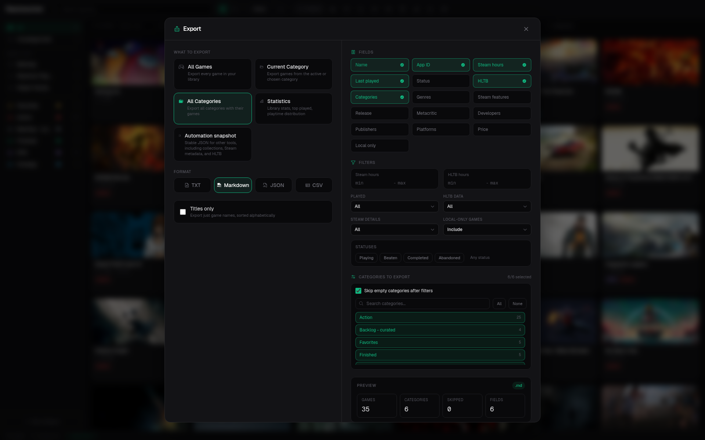

# Export

The export dialog writes filtered library data as TXT, Markdown, JSON, or CSV.

You can choose fields, include or skip categories, constrain playtime and HLTB ranges, select statuses, filter by installed or not-installed games, require metadata, and decide how local-only games are handled. The optional **Installed** field is exported as `true`/`false` in JSON and `yes`/`no` in CSV or text formats.

## Choose the right output

| Format | Best for |
| --- | --- |
| TXT | A simple title list. |
| Markdown | Notes, issues, and human-readable reports. |
| CSV | Spreadsheets and ad hoc analysis. |
| JSON | Programs and lossless structured processing. |

For recurring machine-to-machine delivery, use [Automation Export](../automation-export.md) instead of scripting the interactive export dialog.
